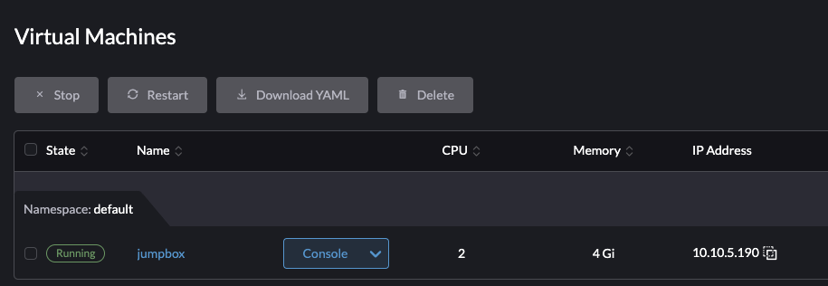
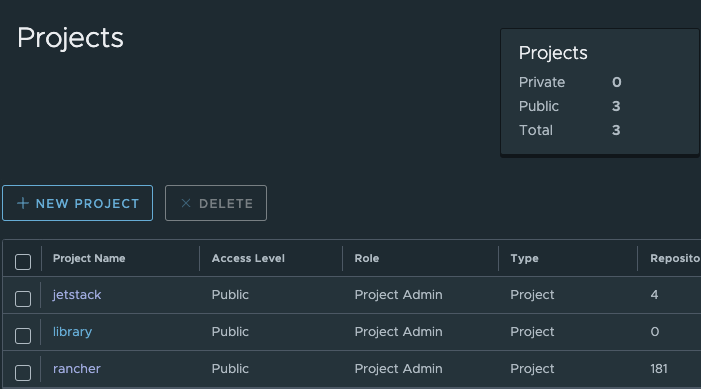
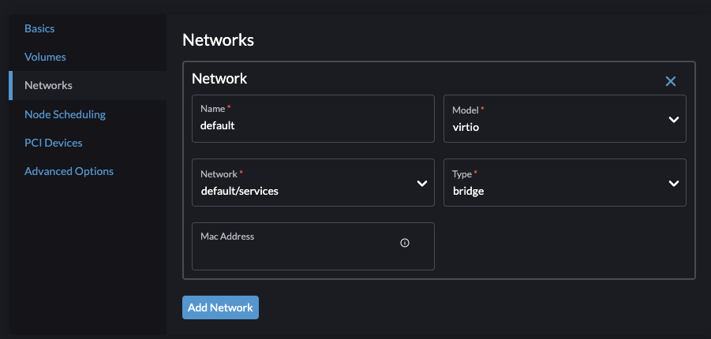
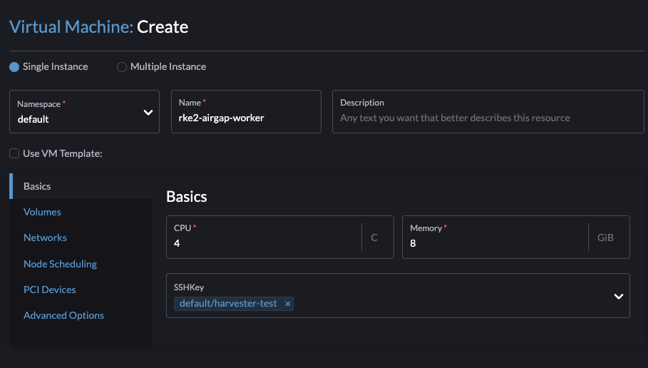

# Manual Provisioning
> * [Prep Environment](#prep-environment)
> * [Pull binaries](#pull-binaries)
> * [Push binaries](#push-binaries)
> * [Provision VMs](#provision-vms)
> * [SCP binaries and scripts into VMs](#scp-binaries-and-scripts-into-vms-control-plane)
> * [Kick off control-plane node](#kick-off-control-plane-node)
> * [Get kubeconfig](#get-kubeconfig)
> * [Kick off worker node](#kick-off-worker-node)
> * [Rancher Install](#rancher-install)

This section will cover manual provisioning. And while its a bit involved, it's important to understand what the steps are and why it's so important to automate. We'll refer to a few of these sections later when we are doing more 'real' methods of bootstrapping with Terraform. Please see the `examples/console.md` for console output examples. I try to keep them out of this document to keep it from getting too long!

Quite a bit of this will be identical to manual installs for RKE2, and we'll add just a few extra steps. It'll be annoying and boring, but its important to understand so we can jump into something more sophisticated like Terraform!

## Prep Environment
Prior to moving into the airgap, we need to prep our physical media with the binaries of everything we're going to need inside the gap. In a hard airgap, such as a SCIF, this will generally mean something like BluRay media; but in a soft airgap, it will involve pushing to a jumpbox of sorts that we have access to in that environment.

This demo is using a soft-airgap, so I'm going to pull the images and binaries down and then push them into the environment. I do this by creating an Ubuntu 20.04 jumpbox:


I then install some starter packages. These are a secret tool we'll need for later!
```bash
sudo snap install helm --classic
sudo snap install kubectl --classic
sudo snap install terraform --classic
wget https://github.com/sigstore/cosign/releases/download/v1.12.1/cosign-linux-amd64
sudo install cosign-linux-amd64 /usr/local/bin/cosign
rm cosign-linux-amd64
wget https://github.com/sunny0826/kubecm/releases/download/v0.21.0/kubecm_v0.21.0_Linux_x86_64.tar.gz
tar xvf kubecm_v0.21.0_Linux_x86_64.tar.gz
sudo install kubecm /usr/local/bin/kubecm
rm LICENSE README.md kubecm kubecm_v0.21.0_Linux_x86_64.tar.gz
git clone https://github.com/ahmetb/kubectx /opt/kubectx
sudo ln -s /opt/kubectx/kubectx /usr/local/bin/kubectx
sudo ln -s /opt/kubectx/kubens /usr/local/bin/kubens
wget https://github.com/mikefarah/yq/releases/download/v4.30.1/yq_linux_amd64
sudo install yq_linux_amd64 /usr/local/bin/yq
rm yq_linux_amd64
```

Once that's done, I'm going to copy my scripts from `bootstrap/airgap_scripts` into my jumpbox. We're using these scripts because they query the public release manifest for RKE2 and Rancher and pull the images and binaries necessary to bootstrap and run those things in an airgap. Otherwise, we'd be doing a LOT of container renaming and no one wants to do that kind of toil here.

After the scripts are in, we can run them with no parameters!

## Pull Binaries
Once my jumpbox is prepped and scripts copied, I can run them to begin pulling the images. Be aware there's about 30GB of images to pull, so do this on a high-speed connection!

The scripts drop the tarballed images into the /tmp directory. So if you are in the situation of a hard air-gap and need to copy these files, pull them from there and put them on physical media. In the demo soft airgap, I'm going to copy the binaries and rke2 install script over to the VMs as needed and push the container images to my local Harbor instance.

## Push Binaries
In order to push these binaries, I need to have projects created in my registry instance that map to the paths the images used. I am using Harbor in my example and it uses the notion of `projects` to separate container images on scope. With what has been pulled, I know that I need two projects created in Harbor: `jetstack` and `rancher`. I'll create those ahead of time and ensure they are listed as 'public' so a local pull can be done without needing credentials. In a real environment, that wouldn't be the case but it simplifies what we're trying to show here.

After creating those projects in my registry, I need to begin pushing images. The `push_images` script is designed to consume the downloaded tarballs and push them to the target regsitry. Here we'll need to provide login credentials to our target internal registry. The syntax is: `./push_images my_registry_url my_username my_password source_tarball_file_location` 

For the purposes of this demo, we've puled two groups of images, cert-manager and rancher itself. So we push each individually.
```bash
./push_images harbor.sienarfleet.systems admin 'my_password' /tmp/cert-manager-images.tar.gz 
./push_images harbor.sienarfleet.systems admin 'my_password' /tmp/rancher-images.tar.gz 
```

Now that all container images have been pushed, I'll do a quick inspection of Harbor to ensure the artifacts are there.



## Provision VMs
We're going to keep the next step simple and create two VMs to run our RKE2 cluster and airgapped Rancher Cluster Manager install. Since this is the manual way, I need to create two VMs in Harvester. I'll make a control-plane node with 2 cores and 8Gbi of memory and a worker node with 4 cores and 8Gbi of memory.

See below for my control-plane node configuration. I'm creating two VMs in my Services VLAN so they will be assigned an IP in the 10.10.5/24 CIDR range.




Below is my worker node which has an identical config other than the core count and memory.



And now both VMs have started and hit my DHCP back-end for IP assignment.


## SCP binaries and scripts into VMs (Control Plane)
Next I'll hop into the VMs to ensure they are running and then copy the RKE2 binaries and RKE2 install script into them.

Once copied, I'll hop into the control-plane VM and create my `/etc/rancher/rke2/config.yaml` file. I explicitly add my hostname here as well as the VIP I intend to use, 10.10.5.4 is a static IP I use in my RCM cluster, and this will generate a TLS cert that accepts that SAN, avoiding any X509 errors. Worth noting here is the `system-default-registry` must be in a registry-format, so any `https` or `http` prefixes must be removed.
```yaml
token: my-shared-token
system-default-registry: harbor.sienarfleet.systems
tls-san:
- rke2-airgap-cp
- 10.10.5.4
```

Next I'm going to add some stuff to `/etc/hosts` to ensure I don't have any DNS issues.
```bash
sudo echo "127.0.0.1 rke2-airgap-cp" >> /etc/hosts
```

Next is adding a `/etc/rancher/rke2/registries.yaml` file to ensure that my RKE2 instance is setting up containerd mirroring to point at my internal Harbor instance:
```yaml
mirrors:
  docker.io:
    endpoint:
    - "https://harbor.sienarfleet.systems"
  harbor.sienarfleet.systems:
    endpoint:
    - "https://harbor.sienarfleet.systems"
```

Now I'll need to generate some static pod manifests for kube-vip by copying the rbac file and then generating the config from the script I pulled. Note where calling the kubevip script I am supplying my VIP address as well as the interface I wish it bound to. In Ubuntu this interface has defauled to `enp1s0` for my VM in Harvester.
```console
ubuntu@rke2-airgap-cp:~$ ip addr
...
2: enp1s0: <BROADCAST,MULTICAST,UP,LOWER_UP> mtu 1500 qdisc fq_codel state UP group default qlen 1000
    link/ether 32:cc:60:38:1d:d3 brd ff:ff:ff:ff:ff:ff
    inet 10.10.5.226/24 brd 10.10.5.255 scope global dynamic enp1s0
```

Copy the kube-vip scripts down:
```bash
sudo mkdir -p /var/lib/rancher/rke2/server/manifests/
sudo cp kube-vip-rbac.yaml /var/lib/rancher/rke2/server/manifests/
cat ./install_kubevip.sh |  vipAddress=10.10.5.4 vipInterface=enp1s0 sh | sudo tee /var/lib/rancher/rke2/server/manifests/vip.yaml
ll /var/lib/rancher/rke2/server/manifests/
```

## Kick off control-plane node
Once the static manifests are present, we can kick off the RKE2 install using a local artifact directory. This will just install the binaries and serivce. After that we need to enable the service and start it:
```bash
sudo INSTALL_RKE2_ARTIFACT_PATH=/home/ubuntu sh install_rke2.sh
sudo systemctl enable rke2-server.service
sudo systemctl start rke2-server.service
```

## Get kubeconfig
At this point, the control-plane node is starting. We can grab the kubeconfig from `/etc/rancher/rke2/rke2.yaml` and change its permissions to copy to our jumpbox.
```console
ubuntu@rke2-airgap-cp:~$ sudo cp /etc/rancher/rke2/rke2.yaml config
ubuntu@rke2-airgap-cp:~$ sudo chown ubuntu: config
```

Now copy the file down and change the API endpoint to our VIP
```console
ubuntu@rke2-airgap-cp:~$ exit
logout
Connection to 10.10.5.226 closed.
ubuntu@jumpbox:~$ scp -i ~/.ssh/harvester_test ubuntu@10.10.5.226:./config .
config                                                                                          100% 2969     6.4MB/s   00:00    
ubuntu@jumpbox:~$ mkdir .kube
ubuntu@jumpbox:~$ mv config .kube/
ubuntu@jumpbox:~$ sed -ie 's/127.0.0.1/10.10.5.4/g' .kube/config
```

Verify the control-plane node is running using `kubectl`:
```console
ubuntu@jumpbox:~$ kubectl get nodes
NAME             STATUS   ROLES                       AGE     VERSION
rke2-airgap-cp   Ready    control-plane,etcd,master   4m22s   v1.24.8+rke2r1
```

Now we can add the worker!

## Kick off worker node
The worker is nearly identical to the control-plane with a few exceptions. We need to ensure the `server` field is present and that the control-plane's hostname resolves so we'll cheat and add it to DNS. We'll also run the install slightly differently as workers only use the agent and not the full apiserver.

Ensure you copy everything over to the worker as well.

Here is our `/etc/rancher/rke2/config.yaml` file for the worker:
```yaml
token: my-shared-token
system-default-registry: harbor.sienarfleet.systems
server: https://rke2-airgap-cp:9345
```

The registries file is the same as above and the kubevip step can be skipped entirely. Now we just run the install script with the agent type toggled on:
```bash
sudo INSTALL_RKE2_ARTIFACT_PATH=/home/ubuntu INSTALL_RKE2_TYPE="agent" sh install_rke2.sh
sudo systemctl enable rke2-server.service
sudo systemctl start rke2-server.service
```

After this is finished, we should be successfully joined to the cluster. So let's hop back out to the jumpbox and verify using `kubectl`.
```console
ubuntu@rke2-airgap-worker:~$ exit
logout
Connection to 10.10.5.170 closed.
ubuntu@jumpbox:~$ kubectl get nodes
NAME                 STATUS   ROLES                       AGE   VERSION
rke2-airgap-cp       Ready    control-plane,etcd,master   16m   v1.24.8+rke2r1
rke2-airgap-worker   Ready    control-plane,etcd,master   58s   v1.24.8+rke2r1
```

Huzzah! We now have a control-plane node and cluster, now inquire the state of the pods:
```bash
kubectl get po -A
```

## Rancher Install
The next step is to install rancher itself, which should be a piece of cake. In this repo you'll find the rancher and cert-manager charts pulled down into tarballs, but if you don't you can grab them for yourself using helm (just make sure you have internet access)

```bash
helm repo add rancher-latest https://releases.rancher.com/server-charts/latest
helm repo add jetstack https://charts.jetstack.io
helm repo update
helm fetch rancher-latest/rancher --version 2.7.0
helm fetch jetstack/cert-manager --version 1.8.1
```

You'll be left with two helm chart tarballs `rancher-2.7.0.tgz` and `cert-manager-v1.8.1.tgz`. We would need to bring these into the airgap too, but we are shortcutting this for now.

Let's install cert-manager first using helm. Note in my example, I am referring to my harbor registry location that I pushed all my images to earlier. Yours will vary!
```bash
helm install cert-manager --create-namespace ./cert-manager-v1.8.1.tgz \
    --namespace cert-manager \
    --set installCRDs=true \
    --set image.repository=harbor.sienarfleet.systems/jetstack/cert-manager-controller \
    --set webhook.image.repository=harbor.sienarfleet.systems/jetstack/cert-manager-webhook \
    --set cainjector.image.repository=harbor.sienarfleet.systems/jetstack/cert-manager-cainjector \
    --set startupapicheck.image.repository=harbor.sienarfleet.systems/jetstack/cert-manager-ctl
```

Next install Rancher with a basic password. Ensure the URL provided in hostname maps to your previously-created (RKE2 step) kubevip VIP address.
```bash
helm install rancher --create-namespace ./rancher-2.7.0.tgz \
    --namespace cattle-system \
    --set hostname=rancher.home.sienarfleet.systems \
    --set certmanager.version=v1.8.1 \
    --set rancherImage=harbor.sienarfleet.systems/rancher/rancher \
    --set systemDefaultRegistry=harbor.sienarfleet.systems \
    --set bootstrapPassword=admin \
    --set ingress.tls.source=secret \
    --set useBundledSystemChart=true 
```

Verify Rancher is installing:
```bash
kubectl get po -n cattle-system
```

It takes some time for Rancher to provision and install. I can now hop into my Rancher instance at `rancher.home.sienarfleet.systems` and set a password then view the dashboard!


Congrats! You've successfully installed an 'airgapped' Rancher and RKE2 instance. That was a lot of work.